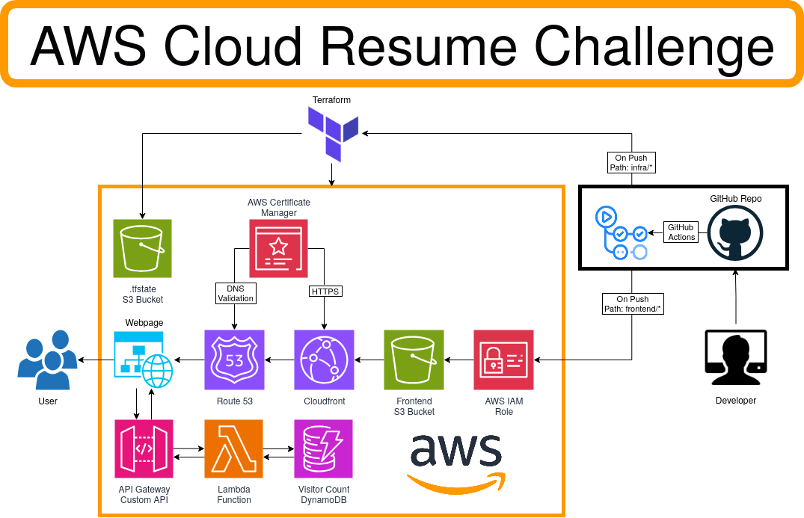

# The AWS Cloud Resume Challenge

This is the repo for my AWS-hosted resume website, created for the [Cloud Resume Challenge](https://cloudresumechallenge.dev/). This project was created to demonstrate competency with fundamental skills in Cloud Engineering and DevOps practices. Check out my resume at [gagelara.com](https://gagelara.com)

## Tools & Services:
- CI/CD: Github Actions.
- Infrastructure as Code: Terraform.
- Serverless: AWS Lambda, Amazon API Gateway, Amazon DynamoDB.
- Static Website: HTML, CSS, JavaScript built with [Hugo](https://gohugo.io/) using a modified version of the [Sada theme](https://github.com/darshanbaral/sada).
- Development Environment: NixOS, with a custom nix-shell.

## Architecture

